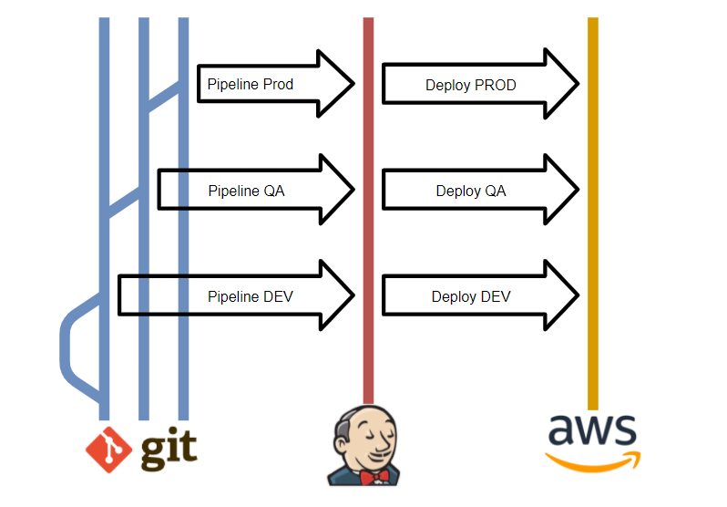

# Challenge Accepted

## Introduction

The project has been developed for technical testing. It consists of 3 microservices that communicate with each other. The aim is to create a small subscription management structure and to demonstrate some of the knowledge of distributed microservice architectures.

The whole project was created with Node version 12 and Express as Framework. I have chosen Express because it is the most established framework on the market for creating faster server-side web applications.

TypeScript was chosen as the language in order to use a modern and typed language which improves the development experience.

## Requirements

In order to download and fully test the project you will need the following tools installed on your computer:
* Git
* Node v12
* NPM v6
* Docker

## How to Install

Please, clone the repository from here, or use the command:

`git clone https://github.com/JaviCoronas/challenge`

You can easily deploy all the architecture with the next command:

`docker-compose up -d --build`

This command will execute the *docker-compose.yml* script and build the images and containers to test the whole project.

In addition to this, each of the microservices can be run separately by following the instructions detailed in their READMEs.

## Specifications

The API specifications and published endpoints can be found at the following link: [API Specifications](http://localhost:40000/api-docs)

If the project is not deployed you can find the specifications at: _/public-service/api/api.yml_

## How to Test

You can test the services with Postman or directly on [Swagger](http://localhost:40000/api-docs)

## CI/CD Pipeline

Inside the three services you can find the _Jenkinsfile_ with the details to include an CI/CD.

In the flowchart above, you can see in broad outline what the flow for deployment looks like.

As a summary, push in branches (dev, qa, prod) triggers a pipeline in jenkins. 
It executes the tasks of cloning the repository, compiling, testing and with the help of AWS CLI creates the repository/container in its infrastructure.
Once a new container image is uploaded to AWS, the service task is restarted with the new changes.

## Thank you

Thank you for giving me the opportunity to do the challenge. I hope you enjoy it and I will be happy to explain any doubts or questions you may have about it.

